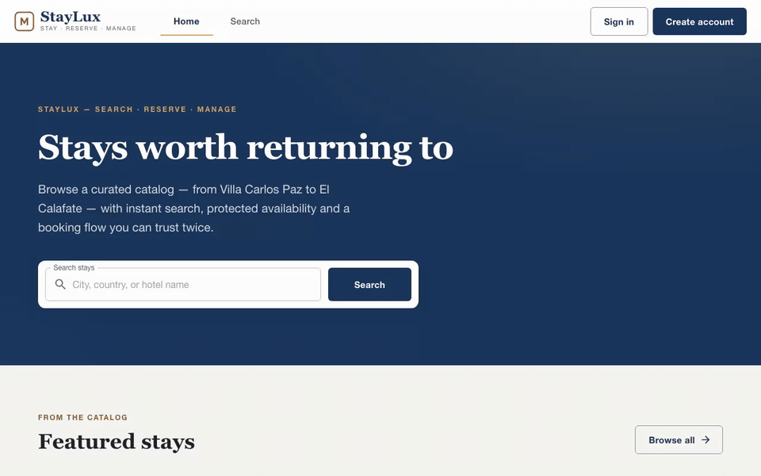
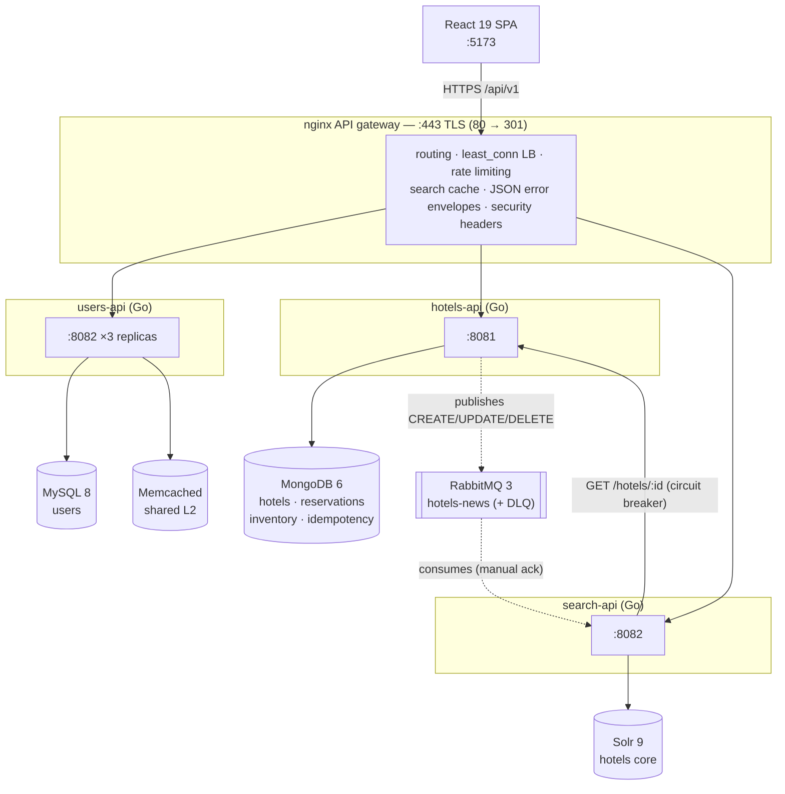

# 🏨 Hotel Search & Booking Microservices Platform

Production-style hotel search & booking: three Go microservices (database-per-service) behind an nginx API gateway, kept in sync through RabbitMQ, with a React SPA on top.

[](https://github.com/Julian0444/Hotel-Search-Booking-Microservices-Platform/actions/workflows/ci.yml)

[](LICENSE)



*More screenshots (search, hotel detail, reservations, admin) in [`docs/screenshots/`](docs/screenshots/).*

---

## 🎯 What this project demonstrates

- **Microservices done with intent** — three Go services with bounded domains and their own stores (MySQL, MongoDB, Solr), a shared contracts module so the event producer and consumer can never drift, and one nginx gateway doing TLS, `least_conn` load balancing over 3 users-api replicas, rate limiting, a search response cache and stable JSON error envelopes with `trace_id`.
- **Event-driven search (CQRS-lite)** — hotel writes publish `CREATE`/`UPDATE`/`DELETE` events to RabbitMQ; search-api consumes them (manual ack → retry → dead-letter queue), rebuilds its Solr index from the source of truth on startup and on `POST /reindex`.
- **No overbooking, by construction** — reservations claim per-night inventory with an atomic `findOneAndUpdate` upsert over a unique index (with compensation on partial failure), so two clients racing for the last room cannot both win; bookings support opt-in **`Idempotency-Key`** retry safety.
- **Distributed auth** — users-api issues HS256 JWTs (`iss`/`aud` per service); every service validates its own audience with role guards (`cliente`/`administrador`) and owner-or-admin resource rules.
- **Multi-level caching** — users: in-process L1 → shared Memcached L2 → MySQL read-through; hotels: cache-aside with denormalized lists; gateway: 5-minute search cache keyed by URI.
- **Operability** — structured JSON logs with request IDs propagated end-to-end, `/livez` + `/readyz` health model, graceful shutdown, a circuit breaker on the search→hotels HTTP path, and Kubernetes manifests with an HPA as an alternative runtime.
- **Tested at every level** — Go unit/controller tests with `-race` and real JWTs, frontend Vitest+MSW suite, Playwright E2E against the real stack, self-verifying API collections, CI with `govulncheck` and Trivy image scanning.

---

## 🏗️ Architecture



The full write-up — service boundaries, the atomic inventory design, the event pipeline, caching, auth, resilience and the trade-off table — lives in [`docs/ARCHITECTURE.md`](docs/ARCHITECTURE.md).

---

## 🛠️ Tech Stack

| Category        | Technology                                                     |
|-----------------|----------------------------------------------------------------|
| **Backend**     | Go 1.25 · Gin · GORM · mongo-driver · solr-go · amqp091-go     |
| **Frontend**    | React 19 · Vite 7 · MUI v7 · react-router 8 · TanStack Query 5 · Axios · react-hook-form |
| **Databases**   | MySQL 8 · MongoDB 6 · Apache Solr 9                           |
| **Cache**       | Memcached 1.6 (distributed L2) · ccache (in-process L1)       |
| **Messaging**   | RabbitMQ 3 (AMQP)                                             |
| **Infra**       | Docker · Docker Compose · Nginx (API Gateway + Load Balancer) · Kubernetes (kind) |
| **Auth**        | JWT HS256 (`iss`/`aud` per service) · bcrypt                   |
| **Testing**     | Go testing · httptest · testify · Vitest · MSW · Playwright · Bruno |

---

## 🚀 Quickstart

Prerequisites: [Docker](https://docs.docker.com/get-docker/) & Docker Compose, [Node.js](https://nodejs.org/) v22+ (frontend only), ~4 GB RAM for the containers.

### 1. Clone the repository

```bash
git clone https://github.com/Julian0444/Hotel-Search-Booking-Microservices-Platform.git
cd Hotel-Search-Booking-Microservices-Platform
```

### 2. Configure environment & generate the local TLS certificate

```bash
cp .env.example .env   # local demo credentials (JWT secret, DB passwords, admin seed)

# The gateway terminates TLS: generate the local self-signed cert BEFORE the
# first `docker compose up` (the .pem files are git-ignored; nginx won't start
# without them). Full details in nginx/certs/README.md.
openssl req -x509 -newkey rsa:2048 -nodes -days 365 \
  -keyout nginx/certs/key.pem -out nginx/certs/cert.pem \
  -subj "/CN=localhost" \
  -addext "subjectAltName=DNS:localhost,IP:127.0.0.1"
```

### 3. Start the backend

```bash
docker compose up -d --build
docker compose ps          # wait until everything is healthy (Solr takes ~90s)
```

This starts **12 containers**: nginx, MySQL, Memcached, MongoDB, RabbitMQ, Solr, users-api ×3, hotels-api, search-api, plus a one-shot `migrate` container that runs the MySQL migrations (schema + demo seed) and exits. The hotel catalog and the Solr index seed themselves on first boot.

### 4. Log in with the demo credentials

| Role | Username | Password |
|------|----------|----------|
| Customer | `demo` | `DemoCliente123` (seeded by the migrations) |
| Admin | `ADMIN_USERNAME` from your `.env` | `ADMIN_PASSWORD` from your `.env` (seeded idempotently at users-api startup; public registration only ever creates customers) |

### 5. Start the frontend

```bash
cd frontend
npm install
npm run dev                # http://localhost:5173 (proxies /api/* to the gateway)
```

Or run the built SPA in Docker instead: `docker compose --profile frontend up -d` (adds `staylux-frontend` on http://localhost:5173).

### Alternative: Kubernetes (kind)

The same platform runs on Kubernetes: Deployments with real readiness/liveness probes, a Service replacing the static nginx upstream (scaling = `kubectl scale`, no YAML duplication), an HPA, and graceful rolling deploys. Dev-only StatefulSets keep the demo self-contained — in production the datastores would be managed services. See [`k8s/README.md`](k8s/README.md).

### Local URLs

| Service            | URL                            |
|--------------------|--------------------------------|
| Frontend           | http://localhost:5173           |
| API Gateway        | https://localhost (self-signed cert; port 80 redirects here) |
| Gateway Monitoring | http://localhost:8090/status (loopback only) |
| RabbitMQ Dashboard | http://localhost:15672 (root/root) |
| Solr Admin UI      | http://localhost:8983/solr      |

---

## 🌐 API Endpoints (Gateway — HTTPS, Port 443)

The gateway terminates TLS on port 443 (TLS 1.2/1.3, HSTS) and port 80 only
answers a `301` redirect to HTTPS. Locally the certificate is self-signed, so
use `curl -k` and accept the one-time browser warning; in production you'd
swap in a real certificate (e.g. Let's Encrypt) — the config doesn't change.

The API is versioned under a `/api/v1` prefix (URI versioning: a breaking change to any contract ships as `/api/v2` alongside `v1`). Success responses use a single envelope — `{"data": ...}` for single resources, `{"data": [...], "meta": {...}}` for lists — and every error (services and gateway alike) has the shape `{"error": {"code", "message", "trace_id"}}` with stable machine-readable codes. Health endpoints are not versioned.

| Method   | Endpoint                                      | Service    | Auth     | Description                     |
|----------|-----------------------------------------------|------------|----------|---------------------------------|
| `POST`   | `/api/v1/users`                               | Users API  | —        | Register a new user (customer role only) |
| `POST`   | `/api/v1/login`                               | Users API  | —        | Login, returns JWT              |
| `GET`    | `/api/v1/users`                               | Users API  | Admin    | List all users                  |
| `GET`    | `/api/v1/users/:id`                           | Users API  | Owner/Admin | Get user by ID               |
| `DELETE` | `/api/v1/users/:id`                           | Users API  | Owner/Admin | Delete user (204)            |
| `GET`    | `/api/v1/hotels?limit=&offset=`               | Hotels API | —        | List hotels (paginated)         |
| `GET`    | `/api/v1/hotels/:id`                          | Hotels API | —        | Get hotel details               |
| `GET`    | `/api/v1/hotels/:id/reservations`             | Hotels API | Admin    | List hotel reservations (PII: guests' `user_id`) |
| `POST`   | `/api/v1/hotels/availability`                 | Hotels API | —        | Check availability (multi)      |
| `POST`   | `/api/v1/reservations`                        | Hotels API | Logged user | Create reservation (201 + `Location`; supports `Idempotency-Key`) |
| `GET`    | `/api/v1/reservations/:id`                    | Hotels API | Owner/Admin | Get reservation              |
| `DELETE` | `/api/v1/reservations/:id`                    | Hotels API | Owner    | Cancel reservation (204, idempotent; admins cannot cancel others') |
| `GET`    | `/api/v1/users/:id/reservations`              | Hotels API | Owner/Admin | User's reservation history   |
| `GET`    | `/api/v1/users/:id/hotels/:hotel_id/reservations` | Hotels API | Owner/Admin | User's reservations in one hotel |
| `GET`    | `/api/v1/search?q=&sort=`                     | Search API | —        | Full-text search (`sort`: `relevance`/`price_asc`/`price_desc`/`rating_desc`) |
| `POST`   | `/api/v1/reindex`                             | Search API | Admin    | Rebuild the Solr index from Hotels API |
| `POST`   | `/api/v1/admin/hotels`                        | Hotels API | Admin    | Create hotel (201 + `Location`) |
| `PUT`    | `/api/v1/admin/hotels/:id`                    | Hotels API | Admin    | Update hotel (returns updated representation) |
| `DELETE` | `/api/v1/admin/hotels/:id`                    | Hotels API | Admin    | Delete hotel (204)              |
| `GET`    | `/api/v1/admin/microservices`                 | Hotels API | Admin    | Platform status (read-only, real `/readyz` probes) |
| `GET`    | `/health`                                     | Gateway    | —        | Gateway health check            |

**Full request/response contract:** OpenAPI 3.0 specs per service in [`docs/openapi/`](docs/openapi/) — [`users.yaml`](docs/openapi/users.yaml) · [`hotels.yaml`](docs/openapi/hotels.yaml) · [`search.yaml`](docs/openapi/search.yaml) (validated with `npx @redocly/cli lint docs/openapi/*.yaml`). Ready-to-run [Bruno](https://www.usebruno.com/) collections live in [`Bruno API tester/`](Bruno%20API%20tester/), with per-request assertions covering the whole table.

> Each Go service also exposes internal (not routed through the gateway) health endpoints: `/livez` (process liveness, `/health` is an alias) and `/readyz` (pings its own dependencies — e.g. Mongo+RabbitMQ for Hotels API — and returns `503` with a per-check status map if any is down). Docker Compose healthchecks hit `/readyz`, and nginx only starts once every upstream is healthy.

---

## 🧪 Testing

```bash
# All Go modules (race detector included)
make test

# A single module
cd users-api && go test ./... -v
```

The frontend has its own test pyramid (Vitest + Testing Library + MSW for unit/component, Playwright for end-to-end):

```bash
cd frontend
npm run test:run        # unit/component suite
npm run test:coverage   # same suite with coverage thresholds
npm run check           # lint + coverage + production build (same gate as CI)

# End-to-end (requires the full stack with the frontend profile):
npx playwright install chromium   # first time only
make e2e                          # or: docker compose --profile frontend up -d --build && cd frontend && npm run test:e2e
```

The Bruno collections double as API smoke tests — every request asserts its expected status (including the idempotent-replay and invalid-sort contract checks):

```bash
cd "Bruno API tester/Users API Collection"    # same for Hotels / Search
npx -y @usebruno/cli run --env local --insecure --env-var admin_password=<your ADMIN_PASSWORD>
```

**Test strategy:**
- **Controller tests:** Gin + `httptest`, real JWT tokens in headers, covers 401/403/400/200 scenarios
- **Service tests:** Mock repositories (main + cache + queue), validates cache-aside behavior and business logic
- **Frontend unit/component:** MSW mocks the `/api/v1` contract (envelopes, errors with `trace_id`); axe runs on every main route
- **Frontend E2E:** Playwright drives the built SPA against the real gateway — anonymous search, customer booking/cancellation, admin CRUD with search sync, service-degradation states, and 320/390 px viewport checks
- **CI:** lint + unit tests (`-race`) + builds per Go module, frontend gate (lint/coverage/build/audit), `govulncheck`, Docker image builds with Trivy scanning; integration and E2E jobs on PRs

---

## 🧠 Architecture decisions & trade-offs

[`docs/ARCHITECTURE.md`](docs/ARCHITECTURE.md) documents the reasoning behind the design: why the inventory claim needs no transactions (and what the compensation path does), why search sync uses thin events + lookup instead of fat events, the exact caching semantics of each tier, the auth model, and a table of **deliberate demo-scope trade-offs with their production answers**.

## 🚢 How I'd take this to production

The demo runs on one machine by design. The path to production, in order of impact:

1. **Secrets & TLS** — move `.env` to a secrets manager (the env contract is already 12-factor); swap the self-signed cert for a real one (config already split — only the files change).
2. **Managed datastores** — RDS/Cloud SQL for MySQL, Atlas with a replica set for MongoDB (the claim/compensation logic carries over unchanged), managed Solr/OpenSearch.
3. **Event reliability** — replace publish-after-write with a transactional outbox (or CDC); today a self-healing publisher + rebuildable index bound the damage of a lost event.
4. **Token lifecycle** — short-lived access tokens + refresh tokens (or a gateway denylist); today JWTs live 24 h and are never revoked.
5. **Cache invalidation across replicas** — pub/sub invalidation for the per-replica L1 (today: a documented ≤30 s stale window on user deletion).
6. **Observability** — Prometheus/Grafana metrics and OpenTelemetry traces; the `trace_id` plumbing and structured logs are already in place.
7. **Delivery** — the CI already builds and scans multi-arch images (GHCR + Trivy); add CD with progressive rollout on the existing k8s manifests (probes, HPA and graceful draining are already wired).

---

## 👤 Contact

**Julian Irusta Roure** — [GitHub](https://github.com/Julian0444)

Licensed under the [MIT License](LICENSE).
