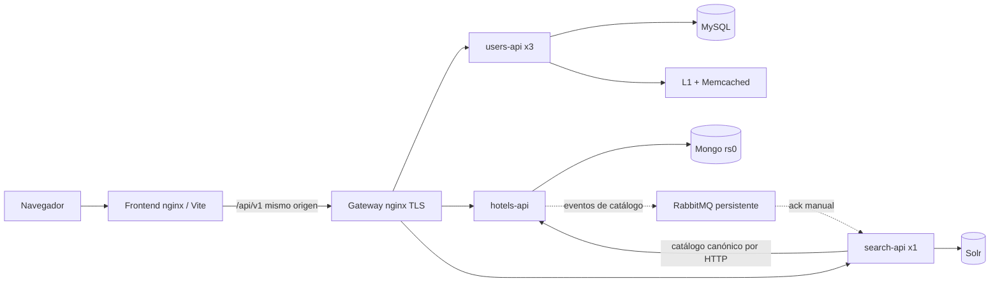

# Arquitectura

La plataforma conserva tres servicios Go y una SPA React. Es un proyecto educativo
para explicar autenticación distribuida, almacenamiento por dominio y búsqueda
con consistencia eventual. Las garantías siguientes corresponden al código y las
pruebas del [cierre](CIERRE.md); no describen una plataforma de pagos ni un servicio
con alta disponibilidad.

## Límites y capas

- **users-api**: registro, login, usuarios y JWT; MySQL es la fuente persistente.
- **hotels-api**: catálogo, reservas, inventario e identidad de intentos en Mongo.
- **search-api**: consulta Solr y mantiene ese índice derivado por eventos y reconciliación.
- **platform-contracts**: contratos HTTP/eventos compartidos y CORS. No comparte bases de datos.

Cada servicio se compone en `cmd/main.go`: controllers → services → repositories.
Los controllers validan HTTP y autorización; los servicios aplican reglas del
producto; los repositorios implementan las garantías propias del almacenamiento.

## Reservas, inventario e idempotencia

Mongo se ejecuta como **replica set `rs0` de un nodo**. Esto habilita transacciones;
no añade redundancia ni protege de la pérdida del único disco. Una transacción
usa lectura snapshot y escritura majority para confirmar juntos:

1. La escritura de `booking_version` del hotel, que coordina reservas,
   cancelaciones, cambios de capacidad y borrado.
2. Los contadores de todas las noches de `[check_in, check_out)`.
3. El documento de reserva.
4. El registro de idempotencia, si el cliente proporcionó una clave.

El índice único `{hotel_id,date}` protege cada contador. Los ObjectID se
normalizan antes de usarlos en referencias y en la huella del intento. El código
rechaza inventario inválido y revisa el estado persistido al arrancar. La
actualización del mismo hotel crea conflictos de escritura entre operaciones
concurrentes: una lectura snapshot por sí sola no alcanzaría para proteger la
capacidad.

La cancelación cambia el estado a `cancelled` y decrementa todas las noches en
la misma transacción. Otra cancelación lee ese estado y no vuelve a liberar.
No hay `releaseNight` con reintentos independientes ni compensaciones después de
un timeout. `WithTransaction` del driver trata los errores transitorios y los
resultados de commit desconocidos. Un fallo de red después de commit no prueba
que la operación falló: se conserva la identidad y se recupera mediante replay.
Los callbacks transaccionales no publican eventos ni ejecutan otros efectos externos.

`POST /reservations` acepta `Idempotency-Key` de 1–200 caracteres, sin espacios
exteriores. Alcance: usuario autenticado + clave + huella canónica de hotel,
fechas, habitaciones y huéspedes. Misma clave/payload recupera el mismo `201`,
`Location` e ID; otro payload devuelve `409 idempotency_conflict`. La persistencia
ocurre antes de responder y sobrevive al reinicio. No existe un registro nuevo
"en vuelo" separado de la reserva. Los rechazos previos a commit no consumen la
clave. El índice TTL permite borrarla **a partir de 24 horas**; la limpieza es
asíncrona. La garantía contractual es de 24 horas, no deduplicación indefinida.
Sin header, cada POST es un intento nuevo: un timeout exige consultar historial
antes de repetir a ciegas.

Los importes se calculan en el servidor: precio de catálogo redondeado a centavos
× noches × habitaciones. `total_price` es entero y `currency` es `USD`. Las fechas
son civiles `YYYY-MM-DD`, con checkout excluido; no se implementan cobros.

## Catálogo y disponibilidad

Se retiró toda la caché de hotels-api. Catálogo, disponibilidad e historial leen
Mongo. Esto elimina listas parciales, invalidaciones entre entidades y un cálculo
alternativo de disponibilidad. `POST /hotels/availability` informa si queda **al
menos una habitación en cada noche**; es una consulta orientativa, no una retención
de cupo. Confirmar vuelve a arbitrar capacidad dentro de la transacción.

POST/PUT requieren nombre, dirección, ciudad, país y horarios `HH:mm` no vacíos.
Capacidad: 0–10000; precio por noche: 0–1000000; rating: 0–5. PUT sustituye la
representación editable completa, incluidos valores cero, textos opcionales
vacíos y arrays vacíos. Cero capacidad cierra nuevas reservas. El ID lo asigna el
servidor. Los rechazos se hacen antes de escribir y publicar.

Una reducción de capacidad se rechaza si queda por debajo de cualquier contador
`booked` existente, incluso de una reserva confirmada histórica. Es una regla
conservadora: el modelo no tiene un proceso de cierre de estadías. El borrado de
un hotel con cualquier historial, incluidas cancelaciones, devuelve 409; el
historial nunca se elimina por un DELETE administrativo.

## Índice, eventos y recuperación

Solr busca nombre, descripción, ciudad y país. Tokenización, minúsculas y
`ASCIIFoldingFilterFactory` en indexación y consulta hacen equivalentes `Córdoba`,
`cordoba` y `CORDOBA`; los campos almacenados conservan el texto original. La
consulta continúa parametrizada y escapada, con whitelist de orden y paginación
global de Solr. El gateway no cachea búsqueda (`Cache-Control: no-store`).

Los eventos de catálogo son señales `{operation,hotel_id}`. El consumidor consulta
el estado **actual** del hotel; un 404 elimina el documento del índice, también
para un evento CREATE/UPDATE antiguo. JSON, operación o ID inválidos van a DLQ;
fallos transitorios conservan el mensaje sin ack y se reintentan con espera
cancelable. No se descartan por fallar dos veces durante una caída. Se retiró el
circuit breaker de ese cliente: timeout HTTP, espera del consumidor y reconexión
son suficientes para este flujo.

Hay **una sola instancia de search-api**, también durante mantenimiento y rollout
(`Recreate` en el ejemplo Kubernetes). Eventos y reconciliación comparten un
bloqueo. Reconciliar enumera IDs del catálogo por cursor `_id` y del índice por
cursor Solr; luego vuelve a consultar cada ID de la unión. Añade faltantes,
actualiza vigentes y elimina huérfanos. No vacía el índice. La consulta fresca
evita que una página antigua se convierta en la representación final de un hotel.
Los cambios ocurridos durante una pasada convergen mediante eventos y nuevas
pasadas periódicas. No se promete una instantánea global de Mongo y Solr.

La reconciliación corre al arrancar, cada minuto y bajo `POST /reindex` admin;
tras un fallo se vuelve a intentar a los 5 segundos. Una pasada tiene presupuesto
de 2 minutos. No es una garantía de convergencia durante una caída sostenida o
escrituras ilimitadas. Escalar a varios escritores requeriría otra coordinación;
no está soportado por este cierre.

El publisher usa mensajes persistentes, cola durable, enrutamiento obligatorio y
confirmación del broker. Un único reconector trabaja en segundo plano. Publicar
incluye espera por concurrencia, I/O y confirmación en un presupuesto de 2s,
o falla antes si el contexto HTTP vence. Un request no ejecuta el backoff de
reconexión. El broker conserva su directorio en un volumen estable.

**Mongo y RabbitMQ no forman una transacción.** Tras persistir un CRUD de hotel,
la API mantiene 201/200/204 aunque falle publicar, y registra el fallo. La
reconciliación periódica recupera esa ventana. Un confirm sólo acredita la
aceptación del broker; no que Solr ya esté actualizado. No hay outbox ni garantía
exactly-once. `reservations-news` y sus contratos/publicaciones se retiraron:
reservar y cancelar no llaman al publisher.

## Auth, caché de usuarios y salud

users-api emite JWT HS256 con `iss=users-api`, audiencias de los tres servicios,
rol y usuario; cada servicio valida su audiencia. El registro público fuerza
`cliente`; el admin se crea por variables de entorno. Ownership y roles se
comprueban en backend. El token no se revoca antes de expirar.

Se conservan tres réplicas de users-api para la demostración de `least_conn`.
L1 tiene TTL configurable (30s por defecto), sin renovación por lectura. L2
Memcached tiene TTL de 300s; ambos guardan por ID y username. Borrar invalida
la L1 de la instancia y las claves L2, no todas las L1. Fallos de invalidación,
lecturas en vuelo y repoblado impiden afirmar un límite universal de 30s para
usuarios borrados. El JWT existente puede seguir válido hasta su expiración.
Una caída de caché permite leer la base.

`/livez` sólo indica proceso vivo. `/readyz` requiere MySQL en users-api, Mongo
en hotels-api y Solr en search-api. Memcached y RabbitMQ aparecen como checks
secundarios: su caída produce estado `degraded` con HTTP 200 cuando la función
principal puede servir; una dependencia obligatoria caída produce 503. SIGTERM
drena HTTP y detiene conexiones/goroutines. Logs y errores comparten `trace_id`.

## Navegador e infraestructura

La SPA usa `/api/v1`. Vite y nginx del frontend lo proxían al gateway TLS local;
el navegador no necesita aceptar un certificado para un segundo origen ni
configurar la URL de API. El gateway preserva headers de auth e idempotencia.
Los proxies renuevan las IP de servicios mediante el DNS de Docker, evitando
conservar destinos antiguos después de recrear un contenedor (nginx 1.27.3+).
OPTIONS queda fuera del presupuesto de rate limit. Login permite 30/min por IP
observada por el gateway con burst 10. Los clientes detrás del proxy frontend
comparten ese presupuesto; no se confía en un X-Forwarded-For arbitrario para
eludirlo. Otras rutas conservan límites generales. Las pruebas que agotan
ese presupuesto son específicas y verifican recuperación.

React Query invalida disponibilidad e historial tras reservar/cancelar. La
selección de reserva viaja por estado del router durante login/registro; el
intento de idempotencia se reinicia al cambiar de usuario. El historial carga
páginas sucesivas y etiqueta contadores como reservas cargadas. La paginación
admin ajusta páginas fuera de rango tras borrar. El router de datos usa
`useBlocker` para formularios sucios y `beforeunload` para salir del documento.

Compose es el entorno principal. Kubernetes es material histórico opcional,
con requisitos y recetas retiradas descritos en [su README](../k8s/README.md).
No se ejecutó un despliegue externo. La variante de dominio público usa el mismo
build relativo; ver el README principal.
