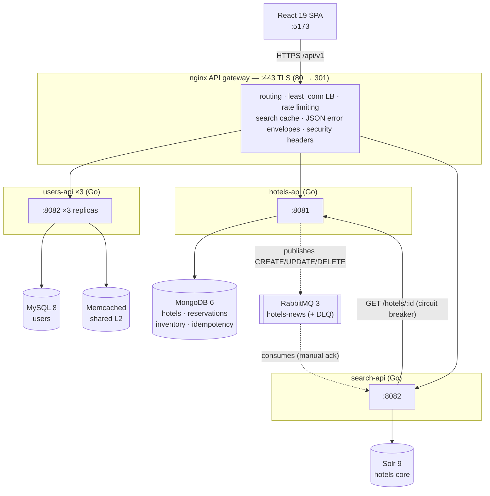
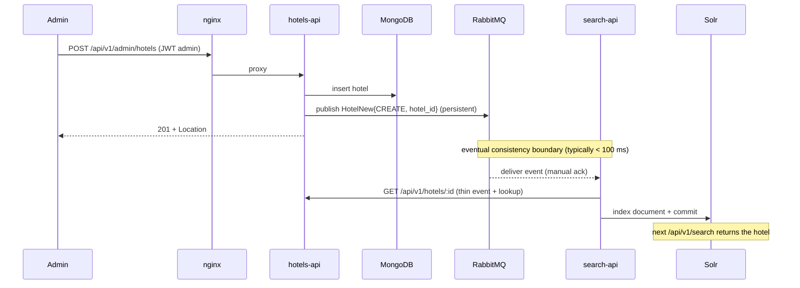

# Architecture

> How the platform is put together and, more importantly, **why**. The goal of this document is to explain the architectural decisions — the trade-offs behind each pattern — not to walk through the code line by line.

The system is a hotel search & booking platform built as **three independent Go microservices** (Users, Hotels, Search) that communicate over **synchronous HTTP** and **asynchronous RabbitMQ events**. Each service owns its data store (**MySQL, MongoDB, Solr** — polyglot persistence). All client traffic enters through an **nginx API gateway** that terminates TLS and does routing, rate limiting and **load balancing across 3 replicas of the Users API**. The frontend is a React 19 SPA.

## Table of contents

- [System overview](#system-overview)
- [Service boundaries](#service-boundaries)
- [Layered layout inside each service](#layered-layout-inside-each-service)
- [The API contract](#the-api-contract)
- [The reservation domain: no overbooking](#the-reservation-domain-no-overbooking)
- [Event-driven search sync (CQRS-lite)](#event-driven-search-sync-cqrs-lite)
- [Caching](#caching)
- [Authentication & authorization](#authentication--authorization)
- [The gateway](#the-gateway)
- [Observability & resilience](#observability--resilience)
- [Data, migrations & seeds](#data-migrations--seeds)
- [Concurrency inventory](#concurrency-inventory)
- [Containers, CI & supply chain](#containers-ci--supply-chain)
- [Kubernetes](#kubernetes)
- [Frontend](#frontend)
- [Testing strategy](#testing-strategy)
- [Deliberate trade-offs (demo scope)](#deliberate-trade-offs-demo-scope)
- [Key files map](#key-files-map)

## System overview



Twelve Compose services in total: nginx, 3× users-api, hotels-api, search-api, MySQL, Memcached, MongoDB, RabbitMQ, Solr, plus a one-shot `migrate` job that runs the MySQL migrations and exits. An optional 13th (`frontend`, behind a Compose profile) serves the built SPA.

## Service boundaries

Each service has a bounded domain and **its own database** — sharing a database across services is the classic microservices anti-pattern. The only ways services communicate are HTTP and events.

| Service    | Domain                                        | Store   | Replicas |
| ---------- | --------------------------------------------- | ------- | -------- |
| users-api  | Identity, authentication, JWT issuing         | MySQL   | 3 (load balanced) |
| hotels-api | Hotel catalog, reservations, availability     | MongoDB | 1        |
| search-api | Full-text search over a derived index         | Solr    | 1        |

A small shared Go module, **`platform-contracts`**, is the single source of truth for the types that cross services: the `Hotel` wire representation and the `HotelNew` event. hotels-api and search-api consume them via type aliases, so the two sides of the queue can never drift apart silently. The module also hosts the shared CORS middleware (env-driven allowlist) used by all three services.

## Layered layout inside each service

All three services follow the same structure, wired in `cmd/main.go` (the composition root):

```
cmd/main.go                ← composition root: builds and injects dependencies
└── internal/
    ├── config/            ← env vars (12-factor)
    ├── controllers/       ← HTTP handlers (Gin): parse, status codes, delegate
    ├── services/          ← business logic and orchestration
    ├── repositories/      ← data access (mysql/mongo/solr/cache/mock)
    ├── dao/               ← persistence models (gorm/bson tags)
    ├── domain/            ← business models (json tags = the API contract)
    ├── middlewares/       ← JWT auth, RBAC, request ID, timeouts
    ├── apperr/            ← the standard error envelope helper
    └── clients/queues/    ← RabbitMQ adapters
```

Services depend on **local interfaces**, not concrete repositories, so implementations are swappable:

- **users-api** has four repository implementations: MySQL, in-process cache (ccache), Memcached, and a mock.
- **hotels-api** has three: MongoDB, ccache (LRU), mock.
- **search-api** has three: Solr, an HTTP client to hotels-api, mock.

`main.go` decides what to inject; tests inject the mocks and never need a database.

## The API contract

Decisions that apply platform-wide (all enforced by tests):

- **URI versioning**: everything lives under `/api/v1`. A breaking change ships as `/api/v2` next to v1. Health endpoints (`/livez`, `/readyz`) are unversioned — they belong to the process, not the contract.
- **One success envelope**: `{"data": ...}` for single resources; `{"data": [...], "meta": {"total", "limit", "offset"}}` for lists. Pagination is `?limit=` (default 20, clamped to 100) and `?offset=`, identical in every service.
- **One error envelope**, produced by every service *and* by nginx itself:

  ```json
  {"error": {"code": "no_availability", "message": "no availability for the requested dates", "trace_id": "9860c40e1c1d..."}}
  ```

  `code` is stable and machine-readable (clients switch on it), `message` is human-readable, and the real cause goes **only to the structured log**, correlated by `trace_id` — handlers never leak driver internals to the client. Domain errors are typed sentinels (`ErrNoAvailability`, `ErrHotelNotFound`, `ErrUsernameTaken`…) mapped with `errors.Is`, never by parsing driver error strings.
- **Writes behave like REST says they should**: `POST` → `201` + `Location` header; `PUT` → the updated representation; `DELETE` → `204`; conflicts → `409` (`no_availability`, `username_taken`, `request_in_flight`).
- **JSON-only, explicitly**: an `Accept` header that cannot take `application/json` gets `406 not_acceptable` instead of a pretend negotiation.
- **Identity convention**: the canonical `user_id` is a **string** everywhere it crosses a service boundary (JWT claim, reservations, DTOs). users-api keeps its `int64` PK as an internal detail and serializes ids as strings.
- **Dates**: reservation check-in/check-out travel as civil dates (`"2026-09-02"`, no time, no zone — serializing RFC3339-UTC shifted dates by one day for users west of UTC). Hotel check-in/check-out *times* are `"HH:mm"` strings. Audit timestamps (`created_at`, `cancelled_at`) stay RFC3339.
- **Money is integer cents** (`total_price` + `currency`), never floats.

The full per-endpoint reference lives in the [OpenAPI specs](openapi/) and the endpoint table in the [README](../README.md#-api-endpoints-gateway--https-port-443).

## The reservation domain: no overbooking

The core invariant: **a hotel-night can never be booked beyond capacity**, under concurrency, on a single MongoDB node.

Why not simpler alternatives:

- *Check-then-insert* (count overlapping reservations, then insert) is a TOCTOU race: two requests both pass the check and both insert. There is no write conflict between two inserts, so the database cannot save you.
- *Multi-document transactions* require a replica set and still wouldn't produce a conflict between two independent inserts without materializing the constraint somewhere.

So the constraint is materialized as **per-night inventory counters** in a dedicated collection with a **unique index on `{hotel_id, date}`**:

1. `CreateReservation` walks the requested nights (checkout day excluded) and **claims each night atomically** with a single `findOneAndUpdate` upsert:
   - filter: `{hotel_id, date, booked ≤ capacity − rooms}`
   - update: `{$inc: {booked: rooms}, $setOnInsert: {capacity}}`

   The filter *is* the capacity check and the update *is* the claim — one atomic document operation, no window between them. A duplicate-key error on the upsert means another request created the night's counter concurrently; the claim retries once without upsert and the filter decides: match → claimed, no match → the night is full.
2. If any night fails, the already-claimed nights are **released (compensation)** and the client gets `409 Conflict` / `no_availability`.
3. Only after all nights are claimed is the reservation document inserted. If the insert itself fails, the claims are compensated too.
4. Releases run on a **non-cancellable context** with bounded retries + backoff: if the client disconnects mid-request, compensation still runs. If a release still fails, it logs for manual reconciliation — the bias is deliberately conservative, because releasing too much would enable overbooking, which is worse than a temporarily blocked night.

**Cancellation is soft**: a `findOneAndUpdate` flips `status: confirmed → cancelled` (returning the pre-image, which makes a second cancel idempotent) and releases the nights. Cancelled reservations stay in the user's history with `cancelled_at` — an auditable record, not a deleted row.

**Idempotent booking** composes with this: `POST /reservations` accepts an opt-in `Idempotency-Key` header. The key is scoped to `(key, user_id)` and stored in MongoDB: the first request executes and persists status+body; a replay returns the stored response byte-for-byte with `Idempotency-Replayed: true`; a concurrent replay while the original is in flight gets `409 request_in_flight`; a `5xx` outcome releases the key so the client can retry. The inventory claim protects against races *between different users*; the idempotency key deduplicates retries *from the same client* — you need both.

## Event-driven search sync (CQRS-lite)

- **Write model**: hotels-api + MongoDB (source of truth).
- **Read model**: search-api + Solr (full-text index optimized for queries).
- **Sync**: RabbitMQ events, eventually consistent.



Decisions worth defending in the design:

- **Thin event + lookup**: the event carries only `{operation, hotel_id}`; the consumer fetches the full document over HTTP. The queue never carries stale representations, and the contract that matters is the HTTP one that's already tested.
- **Durable everything**: queue declared `durable`, messages published `Persistent` — events survive a broker restart.
- **Manual ack + retry + DLQ**: the consumer acks only after indexing succeeds. First failure → requeue; second failure (`Redelivered`) → **dead-letter queue** (`hotels-news-dlq`, wired via a DLX) for inspection/replay. A message that fails to unmarshal is a poison message and goes to the DLQ immediately — requeueing can never fix it. The consumer distinguishes `404` from hotels-api (hotel deleted → drop the event) from `5xx` (transient → retry/DLQ).
- **Self-healing connections on both sides**: the producer connects with exponential backoff (5 attempts, factor 2, 1 s → 30 s cap), listens on `NotifyClose` to reconnect on broker failure, guards channel access with a `sync.RWMutex`, and retries each publish up to 3 times. The consumer runs in a dedicated goroutine with its own reconnect loop, so Gin serves HTTP from the first second regardless of broker health.
- **The index is rebuildable**: Solr is a derived view. On startup search-api **backfills** the whole index by paging hotels-api's `GET /hotels` (with retries + backoff for cold starts), and `POST /api/v1/reindex` (admin-only) triggers the same rebuild on demand. Indexing is idempotent — `id` is Solr's `uniqueKey`, so reprocessing an event can't duplicate documents. Lost events degrade to "stale until next backfill", never to data loss.
- A second queue (`reservations-news`) is declared for reservation events but has no consumer yet — deliberately left as an extension point, on its own queue so `hotels-news` consumers never see a foreign payload.

## Caching

Three different caching strategies, each matched to its access pattern:

### users-api — read-through L1 + L2 + DB

```
GET user ─► L1 ccache (in-process, ~30 s TTL)     ── hit? return
              miss
            └► L2 Memcached (shared by 3 replicas) ── hit? backfill L1 → return
                 miss
               └► MySQL (source of truth)           ── backfill L1 + L2 → return
```

**Why two levels**: L1 is per-process — with three replicas it misses two out of three times for a warm user. L2 is shared: once any replica has fetched a user from MySQL, the other two find it in Memcached. Every level is **double-keyed** (`user:id:N` and `user:username:foo`) because lookups happen by both. Memcached entries carry a real TTL and deletes are deterministic, so eviction behavior is predictable across replicas.

### hotels-api — cache-aside with denormalized lists

ccache (LRU, 100 k items max, 30 s TTL) in front of MongoDB. Alongside single entities it maintains denormalized list keys (`reservations:hotel:<id>`, `reservations:user:<id>`, …) synchronized on writes — a write-through denormalization that makes the hot read paths (a user's reservations, a hotel's reservations) one cache hit. Invalidation is **best-effort by design**: if the cache write fails the operation still succeeds and the log records it; the database is the source of truth and entries age out in 30 s.

### Gateway — HTTP response cache for search

nginx caches `GET /api/v1/search` responses for 5 minutes, keyed by full URI, and serves stale on upstream errors (`X-Cache-Status: HIT/MISS` is exposed). Serving a result up to 5 minutes old is coherent with the model: the Solr index is already eventually consistent, so the cache adds no new class of staleness — it just makes the read model cheaper.

## Authentication & authorization

- **users-api issues** HS256 JWTs with claims `user_id`, `username`, `tipo` (role: `cliente` | `administrador`), plus `iat`/`exp`/`nbf`, `iss: "users-api"` and `aud: ["users-api", "hotels-api", "search-api"]`.
- **Every service validates independently** with the shared `JWT_SECRET`: signature **pinned to HMAC** (any other `alg`, including `none` or an RS256 public-key confusion, is rejected), `iss` checked, and each service requires **its own audience** — a token minted for another audience is useless here. 30 s clock leeway.
- All three services **refuse to start** if `JWT_SECRET` is unset or still the code placeholder — an unforgeable-token platform cannot boot into a forgeable state.
- **RBAC middlewares**: `Authenticate()` (validates and injects claims into the request context), `AdminOnly()`, `LoggedUserOnly()`, `OwnerOrAdmin()` (users-api: `:id` must match the token's `user_id` unless admin).
- **Ownership checks live server-side in handlers**: users can only create/cancel/view their own reservations; listing another user's reservations requires admin. `GET /hotels/:id/reservations` is admin-only because it exposes other guests' `user_id` (PII).
- **Registration can't escalate**: the public `POST /users` always creates `cliente` (the `tipo` field is accepted and ignored). The only admin source is the idempotent startup seed from `ADMIN_USERNAME`/`ADMIN_PASSWORD` — the unique username index makes the three replicas race safely.
- Passwords are bcrypt-hashed; the DAO→domain mapping omits the hash, so no response shape can ever include it.
- The edge adds defense in depth: login is rate-limited to 5/min per IP at the gateway (brute-force mitigation), connections capped at 20 per IP.

## The gateway

`nginx.conf` is the platform's front door (ports: 443 TLS; 80 answers only a `301`; 8090 is a loopback-only monitoring server):

- **Routing** by path to the three upstreams; the SPA and every client speak only to the gateway.
- **Load balancing**: `least_conn` across the three users-api replicas with passive failover (`max_fails=3`, `fail_timeout=30s`) and keepalive pools.
- **TLS termination** (TLS 1.2/1.3) with HSTS; locally the certificate is self-signed (recipe in `nginx/certs/README.md`), in production you'd swap in a real one without touching anything else.
- **Rate limiting**: 10 r/s general API (burst 20), **5 r/min on `/login`** (burst 3), 20 connections/IP. Exceeding a limit returns **`429` with the standard JSON envelope** (`rate_limited`) — not an HTML page, and not a `503` that would masquerade as a dead upstream.
- **Errors in the same contract**: nginx's own `404`, `429` and `502` responses are JSON envelopes with a `trace_id`, so a client (and the SPA's error handling) sees exactly one error shape regardless of who produced it.
- **`X-Request-ID` end-to-end**: the gateway propagates an inbound request ID or generates one, services log it and echo it as the envelope's `trace_id` — one grep correlates a user-visible error with every log line it touched, across services.
- **Security headers** on every route via an included snippet (nginx `add_header` inheritance silently drops parent headers in any location that sets its own — the snippet re-include is the fix).
- **CORS discipline**: the services emit CORS headers (shared `platform-contracts/cors` middleware); the gateway adds them only on responses it generates itself. Emitting them in both places is the classic duplicate-`Access-Control-Allow-Origin` bug that browsers reject.
- Gzip for JSON; monitoring (`/nginx_status`, `/status` JSON) bound to `127.0.0.1:8090` only.

## Observability & resilience

- **Structured JSON logs** (`slog`) from all services, tagged with `service` (and `instance` for the replicated users-api), every request logged with its `request_id`.
- **Health split in two**: `/livez` is process liveness (cheap, no I/O; `/health` aliases it for compatibility) and `/readyz` pings the service's real dependencies **in parallel** (MySQL+Memcached / MongoDB+RabbitMQ / Solr+RabbitMQ) and returns `503` with a per-check map when something is down. Compose healthchecks and the k8s probes hit `/readyz`; nginx only starts once every upstream is ready, which eliminates cold-start `502`s.
- **Admin health panel, honestly**: `GET /api/v1/admin/microservices` probes each instance's `/readyz` concurrently (2 s timeout per probe) and reports measured status + latency. It is read-only — the earlier mock panel that "scaled" and "restarted" services was deleted rather than dressed up.
- **Graceful shutdown** everywhere: on SIGTERM the HTTP server drains in-flight requests (up to 10 s) before queues and DB connections close — this is what makes rolling restarts invisible behind the LB.
- **Request timeouts**: users-api bounds each request and maps `context.DeadlineExceeded` to `503 timeout` — fail fast instead of hanging the client.
- **Circuit breaker** (`sony/gobreaker`) on the search→hotels HTTP hop: if hotels-api misbehaves, the breaker opens for 30 s and event processing fails fast into the retry/DLQ path instead of piling up goroutines on a dead dependency.
- **Startup backfill with retries**: search-api tolerates hotels-api being slower to boot (5 attempts, exponential backoff) and leaves `POST /reindex` as the manual rescue.

## Data, migrations & seeds

- **MySQL schema is versioned** with golang-migrate, executed by a **one-shot `migrate` container** before the three replicas start (`depends_on: service_completed_successfully`). One instance on purpose: three replicas migrating concurrently fight over golang-migrate's advisory lock and can leave the schema dirty. GORM's `AutoMigrate` still exists but is gated behind `AUTO_MIGRATE` (default on for bare `go run` development, off in Compose).
- **Demo data**: MongoDB seeds 5 hotels + indexes via `mongo-init.js` (runs only on a fresh volume); migration `0002` seeds the demo customer (`demo`/`DemoCliente123`, idempotent); the admin comes exclusively from the env seed. `docker compose down -v && up` resets the world.
- **Mongo indexes** created at startup: reservations by `hotel_id`/`user_id`, the idempotency keys, and the **unique `{hotel_id, date}` inventory index** the no-overbooking design depends on.

## Concurrency inventory

Five distinct concurrency mechanisms coexist, each with a job:

1. **Fan-out/fan-in with goroutines + buffered channel** — availability checks run one goroutine per hotel against Mongo; total latency approaches the slowest hotel instead of the sum.
2. **Dedicated consumer goroutine** — the RabbitMQ consumer lives beside the HTTP server for the whole process lifetime, with its own reconnect loop.
3. **Self-healing producer** — `sync.RWMutex`-guarded connection/channel, `NotifyClose` listener, exponential backoff, bounded publish retries.
4. **Parallel health probes** — `/readyz` pings dependencies concurrently; the admin panel probes every instance concurrently with per-probe timeouts.
5. **Per-request goroutines** (net/http's model) behind `least_conn` distribution — plus thread-safe mocks so tests can exercise all of the above under `-race`.

## Containers, CI & supply chain

- **Multi-stage Dockerfiles**: Go toolchain builds a static, stripped binary (`CGO_ENABLED=0`, `-ldflags "-s -w"`); the final Alpine stage carries the binary, CA certs and tzdata, and runs as a **non-root user**. `go.mod`/`go.sum` are copied before source for layer-cached dependency downloads. Cross-compilation is native (`--platform=$BUILDPLATFORM`), QEMU only emulates the tiny final stage.
- **Compose with real dependency ordering**: healthchecks on the databases and `service_healthy` conditions mean no service starts before its dependencies answer; resource limits keep the 12-container stack inside ~4 GB.
- **CI (GitHub Actions)**, per push/PR:
  - 4-module Go matrix: `gofmt`, `go vet`, `golangci-lint`, `go test -race` with coverage, and **`govulncheck`**.
  - hotels-api **integration tests with testcontainers** (PRs).
  - Frontend: lint, unit/component suite with coverage thresholds (run under a west-of-UTC timezone on purpose — it caught a real civil-date bug), production build, `npm audit`.
  - **Playwright E2E** against the full Compose stack with the built SPA (PRs).
  - Docker images built and **gated by Trivy** (HIGH/CRITICAL, fixable) before any publish; on `main`/version tags, **multi-arch (amd64+arm64) images push to GHCR with immutable tags** (`sha-…`, semver) — never a mutable `latest`-only.

## Kubernetes

The same platform runs on Kubernetes ([`k8s/`](../k8s/), kind-friendly): Deployments with real readiness/liveness probes wired to `/livez`/`/readyz`, a Service replacing nginx's static upstream list (scaling users-api = `kubectl scale`, no YAML duplication), an **HPA**, resource requests/limits mirroring Compose, and graceful rolling deploys leaning on the services' SIGTERM draining. Datastores run as dev-only StatefulSets to keep the demo self-contained — [`k8s/README.md`](../k8s/README.md) is explicit about what would be managed services in production.

## Frontend

A React 19 SPA (Vite 7, MUI v7, React Router 8, TanStack Query 5) that consumes the same public contract as any other client — `/api/v1` through the gateway, nothing privileged:

- **Server state lives in TanStack Query** with the envelope/error contract (`trace_id` surfaces in every error state as `Reference: …`); session is validated locally (exp/iss/aud) and cleared without hard redirects.
- **URL as source of truth** for search (query, sort, page survive reload/back); sort options mirror the backend's whitelist.
- **Booking flow**: server-derived totals in cents, per-attempt `Idempotency-Key`, double-submit protection, cancellations visible in history.
- **Accessibility & performance**: axe (serious/critical = 0) across routes, full keyboard support, AA contrast; code splitting keeps the initial payload at ~192 kB gzip with route-level lazy chunks. Lighthouse (mobile, throttled): **94 / 100 / 100 / 100** — desktop 98/100/100/100.
- **Tests**: 131 Vitest specs with MSW mocking the real contract, plus 23 Playwright E2E specs (desktop + mobile) against the real Docker stack — including service-degradation runs (`docker compose stop search-api`) asserting the SPA renders the gateway's 502 envelope with its `trace_id` instead of a white screen.

## Testing strategy

The pyramid, bottom-up — every layer answers a different question:

| Layer | Tooling | What it proves |
| --- | --- | --- |
| Service unit tests | mock repos + mock queue, `-race` | business logic, cache-aside behavior, date rules, event publishing |
| Controller tests | Gin + `httptest`, **real JWTs** | routing, binding (400), authN/authZ (401/403), status codes, envelopes |
| Integration (hotels-api) | testcontainers | the Mongo repository against a real MongoDB — including the atomic inventory claims |
| Frontend unit/component | Vitest + Testing Library + MSW | UI logic against the mocked `/api/v1` contract |
| E2E | Playwright vs. the Compose stack | the four user journeys through nginx TLS, including degradation |
| Load-balancer script | `test_load_balancer.sh` | distribution across the 3 replicas, rate-limit envelopes, zero 5xx under burst |

Auth is tested the honest way: controller tests send real signed tokens through the real middleware — no `ctx.Set("userID")` shortcuts.

## Deliberate trade-offs (demo scope)

Decisions made consciously for a local, single-machine demo — each with its production answer:

| Trade-off | Why it's acceptable here | Production path |
| --- | --- | --- |
| Self-signed TLS certificate | Local demo; browsers warn once, `curl -k` | Real cert (Let's Encrypt); config already split so only the files change |
| Secrets in `.env` | Single dev machine, file is git-ignored | Secrets manager / sealed secrets; env contract already 12-factor |
| Single MongoDB node, no replica set | Keeps the stack light; the inventory design **does not need transactions** | Replica set for availability; the claim/compensation logic carries over unchanged |
| Stale-cache window on user deletion (≤30 s, L1 per replica) | Documented, bounded, demo-scale | Pub/sub invalidation, token denylist, or short-lived tokens + refresh |
| JWTs are never revoked before expiry | Stateless validation is the point of JWTs | Short TTL + refresh tokens, or a denylist checked at the gateway |
| Synchronous `POST /reindex` | Catalog is small; a `200` proves the index is rebuilt | Async job + status endpoint once the catalog outgrows one request |
| Publish-after-write without an outbox | Failure window is: hotel persisted, event lost → index stale until backfill; self-healing publisher + rebuildable index bound the damage | Transactional outbox + relay, or CDC |
| No metrics/tracing backend | Structured logs + request IDs cover the demo | Prometheus/Grafana + OpenTelemetry; `trace_id` plumbing is already in place |

## Key files map

| Concept | File |
| --- | --- |
| Composition roots | `*/cmd/main.go` |
| Shared wire contract (Hotel, HotelNew) | `platform-contracts/contracts.go` |
| Atomic inventory claims + compensation | `hotels-api/internal/repositories/hotels/hotels_mongo.go` |
| Idempotency middleware | `hotels-api/internal/middlewares/idempotency.go` |
| Error envelope | `*/internal/apperr/apperr.go` |
| JWT issuing | `users-api/internal/tokenizers/tokenizers_jwt.go` |
| JWT validation + RBAC | `*/internal/middlewares/auth.go` |
| Three-tier read-through cache | `users-api/internal/services/users/users_service.go` |
| LRU cache with denormalized lists | `hotels-api/internal/repositories/hotels/hotels_cache.go` |
| Self-healing producer | `hotels-api/internal/clients/queues/queue_rabbit.go` |
| Consumer + retry/DLQ policy | `search-api/internal/clients/queues/queue_rabbit.go` |
| Event handler → Solr sync + backfill | `search-api/internal/services/search/search_service.go` |
| Circuit breaker (search→hotels) | `search-api/internal/repositories/hotels/hotels_http.go` |
| Health endpoints (livez/readyz) | `*/internal/controllers/health/health_controller.go` |
| Gateway (routing, LB, limits, TLS, envelopes) | `nginx.conf` |
| Orchestration + healthcheck ordering | `docker-compose.yml` |
| MySQL migrations + demo seed | `users-api/migrations/` |
| Kubernetes manifests | `k8s/` |
